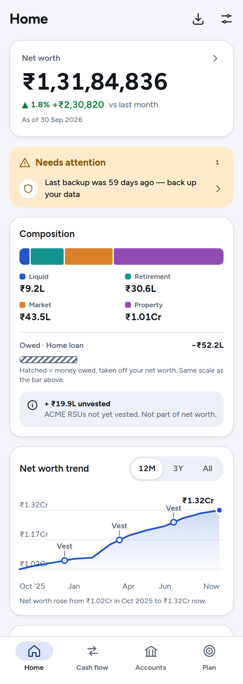
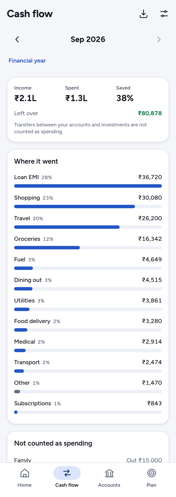
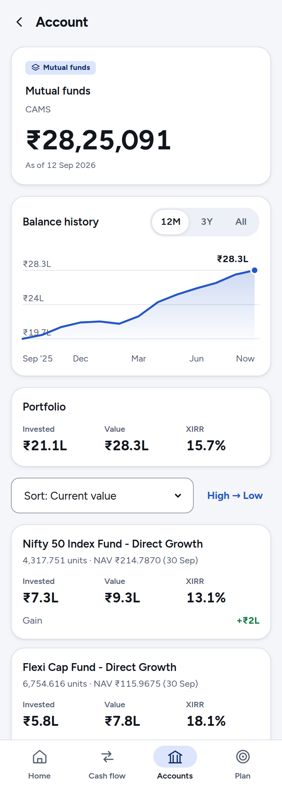
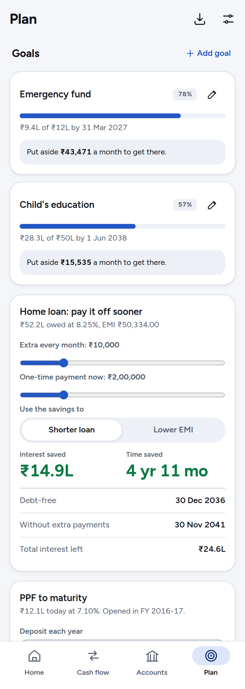

# MyFinance

> A private, offline-first personal finance tracker. Import the statements you already have and get a net-worth view, cash-flow summaries and planning tools, all in your browser.

[](https://github.com/praveensvsrk/MyFinance/actions/workflows/ci.yml)
[](https://github.com/praveensvsrk/MyFinance/actions/workflows/deploy.yml)
[](LICENSE)


**[Live demo](https://praveensvsrk.github.io/MyFinance/)** · [Supported sources](#supported-sources) · [Roadmap](#roadmap) · [Contributing](CONTRIBUTING.md)

<table align="center">
  <tr>
    <td width="25%"></td>
    <td width="25%"></td>
    <td width="25%"></td>
    <td width="25%"></td>
  </tr>
  <tr align="center">
    <td><b>Net worth</b><br>All accounts, one number</td>
    <td><b>Cash flow</b><br>Where the money goes</td>
    <td><b>Investments</b><br>XIRR and cost basis</td>
    <td><b>Plan</b><br>Goals and loan what-if</td>
  </tr>
</table>

<p align="center"><sub>Screenshots use made-up data. Regenerate them with <code>npm run screenshots</code>.</sub></p>

## Why MyFinance

- 🔒 **Private by design.** There is no backend. Your data lives in IndexedDB on your device and never leaves it. The only network calls are public price lookups (see [Prices](#prices)).
- 📄 **Bring your own statements.** No bank logins or aggregators: import the PDFs and spreadsheets you already have.
- 📴 **Works offline.** Installable PWA with an update prompt, and a share target so you can share statements into the app from your phone.

> **Status: early development.** Home, Cash flow, Accounts, Plan, Import and Settings all work end to end.
> Parsers currently target Indian banks and instruments, and the app is mobile-first.

## Features

- **Import**: PDF and XLSX with source auto-detection, password-protected PDFs, a preview with validation checks, duplicate detection and undo.
- **Net worth**: liquid cash, retirement (EPF, PPF), market holdings (mutual funds, employer stock), your home with the loan against it (so you see home equity), and a trend over time.
- **Cash flow**: monthly income and spending, your own categories and rules, a financial-year view against last year, and transfer matching so moves between your own accounts are not counted as income or spending.
- **Loans and mutual funds**: loan rate derivation and an amortisation what-if with prepayments; FIFO cost basis, XIRR, and provisional units for SIPs not yet on a CAS.
- **Equity compensation and planning**: RSU/ESPP lots, vest timeline and INR valuation; EPF/PPF projections and goal tracking.
- **Housekeeping**: a needs-attention list for stale data, mismatches and upcoming dates, plus passphrase-encrypted backup and restore (PBKDF2 + AES).

## Supported sources

| Source | Format |
| --- | --- |
| SBI savings statement (including PPF balance) | PDF |
| Federal Bank savings statement | PDF |
| Union Bank of India savings statement | PDF |
| ICICI Bank credit card statement (password-protected) | PDF |
| Union Bank of India home-loan statement and interest certificate | PDF |
| EPFO member passbook | PDF |
| CAMS consolidated account statement (mutual funds) | PDF |
| E*TRADE / Morgan Stanley at Work client statement | PDF |
| E*TRADE Benefit History | XLSX |

Missing your bank? See [Adding a parser](CONTRIBUTING.md#adding-a-parser).

## Quick start

Requires Node 22.

```bash
git clone https://github.com/praveensvsrk/MyFinance.git
cd MyFinance
npm ci
npm run dev        # http://localhost:5173
```

All scripts, tests and project layout are described in [CONTRIBUTING.md](CONTRIBUTING.md).

## How it works

```
PDF / XLSX  →  parsers  →  domain logic  →  IndexedDB (Dexie)  →  React UI
             (detect +    (pure, tested:    (integer paise,
              validate)    XIRR, net worth)   no float money)
```

Built with React 19, TypeScript, Vite, React Router (hash routing, so it works on static hosting), Dexie, pdf.js (text extraction in a worker), SheetJS, ECharts (lazy-loaded) and Workbox via `vite-plugin-pwa`. Tests use Vitest, Testing Library and Playwright.

## Configuration

There is nothing to configure for the employer stock. Its ticker is read from the E*TRADE files you
import (the `Symbol` column of the Benefit History workbook and the `<COMPANY> (<SYMBOL>)` holding
row of the client statement) and kept in the app's settings; the latest import wins. Until one
is imported there is no employer stock, so no quote is fetched and no price warning is shown.

### Prices

A daily refresh (at most once per 20 hours) stores prices in IndexedDB so the app keeps working offline:

- employer stock: [Finnhub](https://finnhub.io) quote API. Enter your own free API key in **Settings**.
- USD to INR: Frankfurter, with open.er-api.com as a fallback.
- mutual fund NAVs: mfapi.in.

Without a Finnhub key the app still works; the employer stock is simply not re-valued.

These lookups send the employer ticker, fund names and ISINs to those services. The Finnhub key is kept encrypted (AES-GCM, with a non-extractable key held in a separate browser database), and a Content-Security-Policy limits the page to these hosts. Statement passwords are used for the import in progress and never stored.

## Roadmap

- [x] Parsers for the sources above, with validation
- [x] Domain logic: net worth, cash flow, loans, mutual funds, equity, projections
- [x] Import flow with preview, duplicate detection and undo
- [x] Encrypted backup and restore
- [x] Installable PWA with offline support
- [x] Home, Cash Flow, Accounts and Plan screens
- [x] Net-worth trend and account history charts
- [ ] More banks and brokers

## Contributing

Contributions are welcome. See [CONTRIBUTING.md](CONTRIBUTING.md) for setup, tests, fixtures and deployment.
**Never commit real statements, passwords or API keys.**

## License

[MIT](LICENSE) © 2026 Praveen Sreepada
